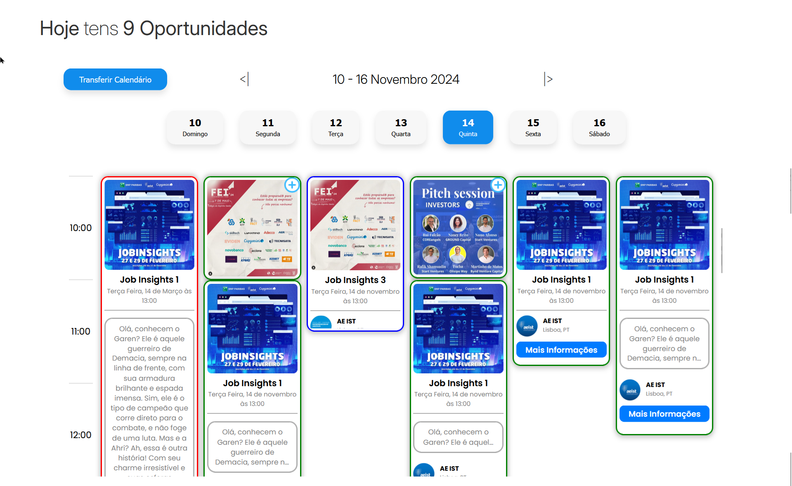
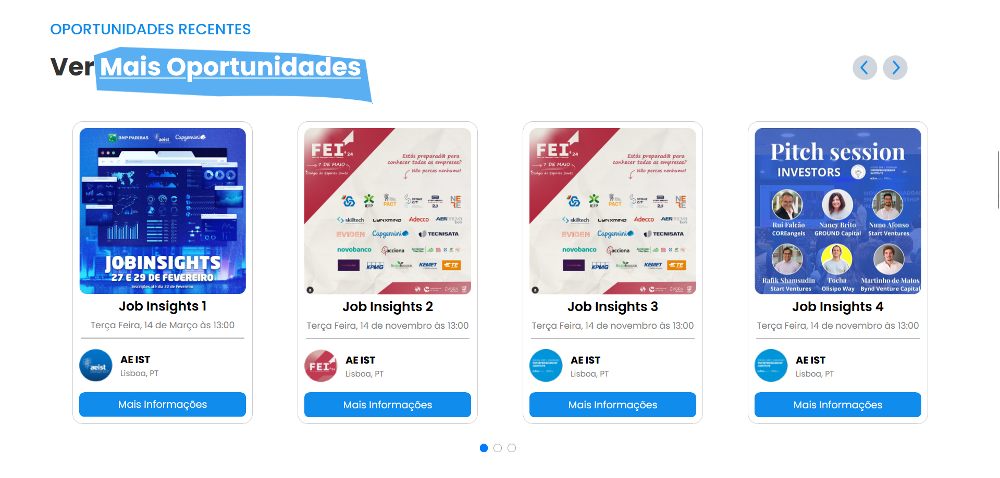

# Student X

A **platform built by students, for students,** dedicated to narrowing the gap between academic potential and professional growth. Explore opportunities that empower students to thrive personally and professionally. **Live now** at www.studentx.pt.

Hosted on GitHub Pages and maintained by a small team, **Student X** is a non-commercial, public-access platform developed by Rafael Faustino, Tomás Sousa, and Miguel Abelho.

# Key Features

- **Smart Calendar**: Interactive event calendar with personal calendar integration
- **Mobile-First Design**: Fully responsive across all devices
- **Real-Time Updates**: Regularly refreshed opportunities from partner organizations
- **Clean UI/UX**: Intuitive navigation and modern design

# Tech Stack

- **Frontend**: HTML5, CSS3, JavaScript
- **Data Management**: JSON
- **Hosting**: GitHub Pages / Cloudflare / Dominios
- **Responsive Design**: Custom CSS

# Screenshots

*An intuitive calendar interface showcasing today's events, complete with color-coded entries and options to integrate events into personal schedules.*

*Dynamic event carousel highlighting the latest opportunities, featuring visually engaging titles and descriptions for quick browsing.*

# Local Development

- git clone https://github.com/GameDevRafael/studentx.git
- cd studentx
- Open index.html in your browser

# Contact

- Rafael Faustino - [LinkedIn](https://www.linkedin.com/in/rgtd-faustino/)

- Tomás Sousa - [LinkedIn](https://www.linkedin.com/in/tomás-lopes-patrão-de-figueiredo-e-sousa-25ab0131a/)
    
- Miguel Abelho - [LinkedIn](https://www.linkedin.com/in/miguelabelho/)

# License

All rights reserved. © 2024 Student X Team

[LICENSE](LICENSE.md) | [Privacy Policy](https://www.studentx.pt/Pol%C3%ADtica%20de%20Privacidade%20e%20Cookies/) | [Terms of Service](https://www.studentx.pt/Termos%20e%20Servi%C3%A7os/)
